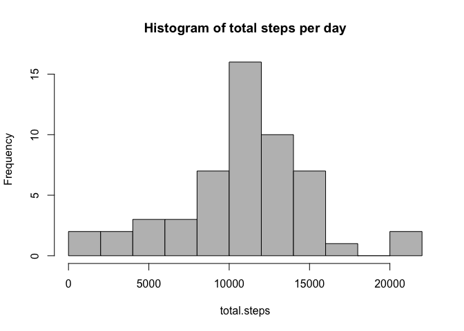
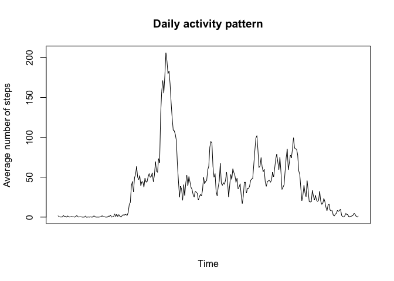
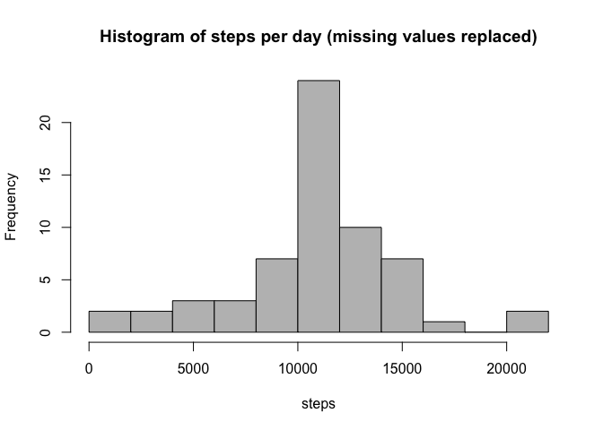
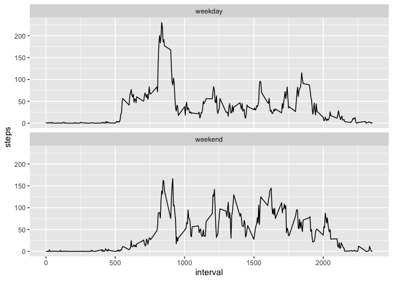

## Loading and preprocessing the data
Downloading data and reading it using read.csv():


```r
if (!file.exists("activity.zip")){
      download.file("https://d396qusza40orc.cloudfront.net/repdata%2Fdata%2Factivity.zip",
                    destfile = "activity.zip", method = "wget")
      unzip("activity.zip")
}
activity <- read.csv("/Users/edmondlau/R/datasciencecoursera/Reproducible Research/activity.csv")
```

The tapply function with the arguments `FUN = sum` and date as the index sums 
up all steps taken during a day and outputs a vector.

```r
total.steps <- tapply(X = activity$steps, INDEX = activity$date, FUN = sum)
```


## What is mean total number of steps taken per day?
First, this is a histogram of the total number of steps taken per day. Note that
a histogram is not a time series plot. The x-axis shows intervals of the number
of steps taken during a day while the y-axis shows the number of days with
the respective amount of steps.

```r
hist(total.steps, breaks=10, main="Histogram of total steps per day", col="gray")
```

<!-- -->

The mean number of steps taken per day is 
1.0766189\times 10^{4}
while the median is 
10765.

Note that it makes a difference whether the NAs get removed before or after the
calculation of the mean or median. Using the above method, which is the one I 
personally prefer, all days that contain NAs don't get included in the calculation
of the mean or median because the day will be NA using tapply. It will be 
automatically dropped using aggregate (not shown here).

However, using 

```r
total.steps2 <- tapply(X = activity$steps, INDEX = activity$date, FUN = sum, na.rm=T)
```
and 

```r
mean(total.steps2)
```

```
## [1] 9354.23
```

```r
median(total.steps2)
```

```
## [1] 10395
```
results in a lower mean and median because the days with NAs of course have
relatively low values. We don't know what caused the NAs. Possibly the person has not
worn the device or the battery was depleted etc. Those days should thus be 
completely excluded, so they do not bias any calculations.

Code:

```r
mean(total.steps, na.rm = T)
```

```
## [1] 10766.19
```

```r
median(total.steps, na.rm = T)
```

```
## [1] 10765
```


## What is the average daily activity pattern?
Note that the units on the x-axis have been removed
since by default the index would have been displayed which relates to the 
number of the 5 minute interval but not the time. Plotting the whole data frame
leads to a distortion as there are only 60 minutes in an hour and subsequently
the x values are not equally spaced.

It would have been possible to plot the time of the day, too, but that would 
have required converting the data into a time series which was not the task
(the task was to use `type = "l"`).

```r
interval.steps <- tapply(X = activity$steps, INDEX = activity$interval, 
                         FUN = mean, na.rm = T)
plot(interval.steps, type="l", xaxt="n",
     main="Daily activity pattern", 
     xlab="Time", ylab="Average number of steps")
```

<!-- -->

> Which 5-minute interval, on average across all the days in the dataset, 
> contains the maximum number of steps?

```r
interval.steps[which(interval.steps == max(interval.steps))]
```

```
##      835 
## 206.1698
```

The interval 835 (= 08:35) contains the maximum average number of steps (206).


## Imputing missing values

```r
sum(is.na(activity$steps))
```

```
## [1] 2304
```
The total number of missing values is 2304.

For imputing the missing values I chose the strategy to replace the NAs by 
the mean of the respective 5 minute interval. This corresponds to the plot above.

I loop over all rows of the data frame (i) to find missing values
and replace missing values by the appropriate mean value. That value is 
determined by looking at the interval during which the observation is missing.
The mean values are in the data frame mean_values. Since the step count is an
integer the mean values are rounded. The new dataset is activity2.


```r
activity2 <- activity
for (i in 1:nrow(activity2)){
      if (is.na(activity2[i, 1])){
            # Which interval does the missing value belong to?
            int_nr <- activity2[i, "interval"]
            
            # Store replacement value in the object replacement
            replacement <- interval.steps[names(interval.steps) == int_nr]
            # Round mean because steps is supposed to be integer
            replacement <- round(replacement)
            
            # Replace NA by replacement
            activity2[i, 1] <- replacement
      }
}
# Show some rows of the resuting data frame. These were all NA before:
activity2[109:120,]
```

```
##     steps       date interval
## 109   143 2012-10-01      900
## 110   124 2012-10-01      905
## 111   109 2012-10-01      910
## 112   108 2012-10-01      915
## 113   104 2012-10-01      920
## 114    96 2012-10-01      925
## 115    66 2012-10-01      930
## 116    45 2012-10-01      935
## 117    25 2012-10-01      940
## 118    39 2012-10-01      945
## 119    35 2012-10-01      950
## 120    21 2012-10-01      955
```

Next, let's check the differences between activity and activity2 which contains
the imputed values:


```r
hist(aggregate(steps ~ date, FUN=sum, data=activity2)$steps, breaks=10,
     main="Histogram of steps per day (missing values replaced)", col = "gray",
     xlab = "steps")
```

<!-- -->

The mean number of steps taken per day using activity2 is 
1.0765639\times 10^{4}
while it was 
1.0766189\times 10^{4}
before.
The median using activity2 is 
1.0762\times 10^{4}
while it was 
10765
using the original data.

Code:

```r
mean(aggregate(steps ~ date, FUN=sum, data=activity2)$steps)
```

```
## [1] 10765.64
```

```r
median(aggregate(steps ~ date, FUN=sum, data=activity2)$steps)
```

```
## [1] 10762
```

Imputing data leads to a higher mean (only a little difference, no difference 
when rounded) and a slightly lower median. 
A lower variance is
apparent when comparing the histograms. In activity2 there is a stronger
concentration of observations around the mean of the distribution (note the 
different y-axis limits).


## Are there differences in activity patterns between weekdays and weekends?

Task:

> Make a panel plot containing a time series plot (i.e. type = "l") of 
> the 5-minute interval (x-axis) and the average number of steps taken, 
> averaged across all weekday days or weekend days (y-axis).
I loop over all rows, determine the day, determine if the day is a weekday or 
weekend and store the result in a new factor variable week.


```r
week <- rep(NA, times = nrow(activity2))
for (i in 1:nrow(activity2)){
      day <- as.POSIXlt(activity2[i, "date"])$wday
      # 0 means sunday, 6 means saturday
      if (day == 0 | day == 6) week[i] <- "weekend"
      else week[i] <- "weekday"
}
week <- factor(week) # convert to factor
activity2 <- cbind(activity2, week) # merge
str(activity2)
```

```
## 'data.frame':	17568 obs. of  4 variables:
##  $ steps   : num  2 0 0 0 0 2 1 1 0 1 ...
##  $ date    : chr  "2012-10-01" "2012-10-01" "2012-10-01" "2012-10-01" ...
##  $ interval: int  0 5 10 15 20 25 30 35 40 45 ...
##  $ week    : Factor w/ 2 levels "weekday","weekend": 1 1 1 1 1 1 1 1 1 1 ...
```

Then I calculate the means of the intervals split by the factor variable week
using tapply. Subsequently melt reformats the data so that there is an 
additional column "week" containing "weekday" or "weekend". I use ggplot to
plot the data and give the original intervals on the x-axis this time for 
better interpretability.


```r
library(reshape2)
library(ggplot2)
plotdata <- with(activity2, tapply(steps, INDEX = list(interval, week), mean))
plotdata <- melt(plotdata, id=c("weekday", "weekend"),
                 varnames = c("interval", "week"), value.name = "steps")
head(plotdata)
```

```
##   interval    week      steps
## 1        0 weekday 2.28888889
## 2        5 weekday 0.40000000
## 3       10 weekday 0.15555556
## 4       15 weekday 0.17777778
## 5       20 weekday 0.08888889
## 6       25 weekday 1.57777778
```

```r
ggplot(plotdata, aes(interval, steps)) + geom_line() + facet_wrap(~week, nrow=2)
```

<!-- -->

As can be seen, the person gets up a bit later on weekends. There is no sudden
increase in steps at a few minutes past five. Additionally, the activity is more 
evenly distributed.
